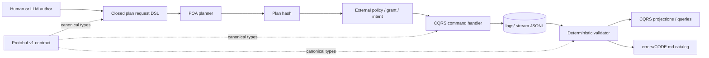

# Logs control-plane architecture

Status: accepted v0.4 design. The v0.1 design came from `ticket-001`; `ticket-004`
revised it against the first real deployment, `ticket-011` added bounded
adopter-owned error catalogs, and `ticket-013` added a closed operational
diagnostic context without moving runtime ownership into this standard (see
[Deployment evidence](#deployment-evidence-c2004)).

## Scope

`wellmanifest/logs` controls the repository representation of operational
events and reusable error knowledge. It validates facts and adopter
conformance; it is not a general logging backend, a secret store, the owner of
product-specific diagnoses or a generic command executor.

The canonical cross-language model is Protobuf. Git stores deterministic JSON
projections because JSONL supports review, replay and one-event-per-line
append semantics. Error guidance is Markdown for humans and agents, with one
closed JSON DSL object embedded in each `errors/{CODE}.md` file.

## Reference architecture

No arrow grants authority implicitly. A valid DSL, schema, Protobuf message,
plan or LLM answer is evidence only. Mutation requires an external authority
boundary bound to the exact plan and target.

## POA processes

The v0.1 namespace declares exact logical processes:

| URI Process | Kind | Responsibility |
| --- | --- | --- |
| `logs://repository/contracts/query/inspect` | query | Return contract identity and capabilities. |
| `logs://repository/events/query/validate` | query | Validate all streams and error documents without mutation. |
| `logs://stream/events/query/plan-append` | query | Produce a secret-free append plan for an immutable event draft. |
| `logs://stream/events/command/append` | command | Append only through a trusted, plan-bound controller. |
| `logs://repository/errors/command/register` | command | Register a reviewed error definition and runbook. |

The request grammar exposes only `inspect` and `plan_append`. It cannot
generate `append`, a path, URI binding, grant, intent, credential, shell command
or transport setting.

## CQRS boundary

Commands validate expected stream version, idempotency, authority and domain
invariants before emitting an event. They do not edit past events. Queries read
contracts, validate the store or build projections and must not mutate state.

The repository conformance runtime implements the read-only query side. The
Protobuf contract reserves the command boundary for trusted adapters; v0.1 does
not pretend that local validation is an authorization service.

## Event Sourcing projection

Each `logs/{stream}.jsonl` line is one canonical `wellmanifest.logs/event/v1`
object. A stream has:

- a stable stream name and monotonic sequence starting at 1;
- a unique event ID, correlation ID and optional causation ID;
- a bounded severity, producer, subject and outcome;
- an event type that is either a reserved core name or a namespaced deployment
  type such as `ticket.status_change`;
- `source`, the emitting subsystem, kept separate from `producer`, who acted;
- `mode`, either `PLAN` or `APPLY`, so a proposal is representable;
- `subjectState`, the subject's own lifecycle state, never the operation outcome;
- `inputHash`, binding the canonical command input;
- optional evidence references with exact SHA-256 digests;
- optional `receiptRef`, null until a POA execution produced a receipt;
- an optional closed `diagnostic` context for phase, status, retryability,
  attempt counters, duration, endpoint origin/reference, transport/HTTP status,
  remediation references and trace correlation;
- `previousHash`, with 64 zeroes at genesis, and a recomputed `eventHash`;
- explicit `rawOutputIncluded=false` and `secretMaterialIncluded=false`.

There is no arbitrary payload or raw message field. This deliberately trades
convenience for predictable review and a smaller exfiltration surface;
`inputHash` is what keeps such an event verifiable without storing the input.

`diagnostic.endpointRef` is either an opaque `endpoint:` reference or an HTTP(S)
origin. Userinfo, paths, query strings and fragments are not representable, so
a producer cannot accidentally persist a token-bearing request URL. Runtime
codes and detailed procedures remain adopter-owned error/runbook references.
The context is optional so every valid v0.1-v0.3 event remains valid in v0.4.

## Error knowledge

Every stable runtime code must have exactly one `errors/{CODE}.md`. The file
title, filename and embedded `wellmanifest.logs/error/v1` object must agree.
Required human sections explain situation, meaning, safe resolution,
verification, prohibited shortcuts and related event types.

The checker validates the catalog bidirectionally: emitted codes cannot lack a
page, and pages cannot invent codes not present in the contract bundle.

An adopter keeps its runtime codes in its own repository. Its closed
`wellmanifest.logs/adopter-error-catalog/v1` manifest pins the exact canonical
contract SHA-256, declares one non-`LOGS` uppercase namespace, a confined
Markdown directory and the complete sorted code set. The `error-adoption`
query validates those pages with the same `wellmanifest.logs/error/v1` shape
and category vocabulary. It never registers a code in Wellmanifest, appends an
event or authorizes the documented remediation.

### ERROR → Strategy → Policy

The three layers have separate ownership and authority:

- **ERROR** is a stable diagnosis: meaning, possible causes, verification,
  owner and prohibited shortcuts. It records a fact; it neither grants
  permission nor chooses an implementation.
- **Strategy** is a target-owned proposal for leaving the error state. A target
  may offer retry, compensate, defer, degrade, escalate or no-change exits.
  Strategies remain replaceable and propose-only; this standard does not force
  one command, algorithm, tool or topology.
- **Policy** is a closed set of invariants and prohibitions that filters
  strategies. Every state policy can create must retain at least one safe
  terminal route, including escalation or no-change when automatic repair is
  unsafe.

The reusable standard therefore defines forbidden outcomes, not a universal
recipe: no secret-bearing diagnosis, no authority inferred from a runbook, no
overwrite of published history, no fabricated success, no destructive repair
from unverified evidence and no namespace impersonation. Runtime repositories
choose how to implement an admissible strategy and retain ownership of their
codes and runbooks.

Contract revisions are immutable files. Historical events continue to point
to `contracts/logs.contract.json` v0.2 and
`contracts/logs.contract.v0.3.json` bytes; v0.4 is published separately as
`contracts/logs.contract.v0.4.json`, with a separately versioned Protobuf file.
A later revision adds new files and a successor event instead of changing
evidence referenced by existing history.

The Buf module selects only the v0.4 Protobuf root. The immutable predecessor
file remains evidence-addressable in Git outside the current compilation unit;
compiling both would create duplicate package symbols rather than preserve
compatibility.

## Deployment evidence (c2004)

v0.1 was designed against a single bootstrap event. `maskservice/c2004` ran an
independent event log — `subactor.operational-event.v1`, projected as `SODL/1`
and `PLOG/1` — for three weeks. Its 315 events are the first real measurement of
the assumptions in this document.

| Observation in c2004 | Count | Consequence for this standard |
| --- | --- | --- |
| `oql` types were `ticket.create`, `ticket.update`, `ticket.status_change` | 3 distinct / 315 | A closed core enum cannot express a deployment's own domain. `eventType` became an open union: reserved core names plus a namespaced pattern, with the `logs.` namespace reserved. |
| `actor` (`system`, `human`, `decompose`, `cursor`) varied independently of `source` (`planfile.history`, `planfile.ticket`) | 4 × 2 | Who acted and which subsystem emitted are separate facts. `source` was added alongside `producer` rather than collapsing both. |
| `status` carried `done`, `open`, `blocked`, `in_progress`, `waiting_input`, `cancelled` | 6 distinct | That is subject lifecycle, not the outcome of the append. `subjectState` was added so `outcome` keeps its five bounded values. |
| `input_hash` present on every event; no event referenced a file artefact | 315 / 0 | Requiring at least one evidence file made ordinary domain events unrepresentable. `evidence` may now be empty when `inputHash` binds the input. |
| `receipt_ref` was the string `"-"` | 315 / 315 | A placeholder makes an unexecuted event indistinguishable from an executed one. `receiptRef` is null when absent, and `"-"` is rejected. |
| `causation_id` was the string `"-"` | 315 / 315 | Same defect. The sentinel belongs to the line-oriented projection, never to the canonical JSON. |
| `mode` was always `apply` | 315 / 315 | The plan half of the POA split was never observable. `mode` is a required `PLAN`/`APPLY` enum. |
| `replayable` was always `true`; `kind` was always `task` | 315 / 315 | A dimension that never varies is not audit evidence. Both were considered and deliberately not adopted. |
| `previous_hash` and `sequence` were absent | 0 / 315 | The deployment kept no hash chain, so ordering rested on file append order alone. The chain requirement stands; `logs/control.jsonl` now carries two chained events so the rule is exercised rather than assumed. |
| Daily rotation left three 0-byte segments | 3 of 6 | Already rejected by `LOGS-STORE-EMPTY`. No change needed; the existing rule is validated. |
| `SODL/1` and `PLOG/1` named the same field differently (`oql`/`type`, `data.payload`/`logic`) and `PLOG/1` dropped `input_hash` | — | Unmapped projection drift. Not fixed in v0.2; recorded as the open risk for the next revision. |

Two conclusions carry beyond the field list. First, the reserved-vocabulary
approach only works when a deployment has somewhere else to put its own names.
Second, an optional field whose absence is written as a sentinel string is worse
than no field, because validation cannot distinguish absence from a value.

## Invariants

1. Protobuf field numbers and enum values are stable within v1.
2. All JSON object schemas are closed.
3. JSONL bytes are canonical and hash chained.
4. Repository-relative evidence cannot escape the root and must match bytes.
5. Raw output, secrets, unknown fields and unbounded payloads are rejected.
6. Error documentation never waives a finding.
7. LLM output is propose-only and never a command, grant or approval.
8. A deployment event type is namespaced and never squats the reserved `logs.`
   namespace.
9. An absent optional value is `null`. A sentinel string is rejected, because
   validation must be able to tell absence from a value.
10. Every event binds its command input with `inputHash`, so an event carrying
    no file evidence is still verifiable.
11. A published contract path is immutable; successor contracts use a new
    versioned path and a successor event.
12. Adopter error namespaces and runbooks stay in the adopter repository and
    cannot use the standard-owned `LOGS` prefix.
13. Every policy-created nonterminal state has a documented safe exit; a
    rejection must not reserve work forever or make recovery impossible.
14. Error identity and forbidden outcomes are standardized; implementation
    recipes remain target-owned and replaceable.
15. Operational diagnostics are closed, bounded and secret-free: an endpoint
    is an origin/reference, retry counters are coherent and trace IDs are
    identifiers rather than arbitrary text.
