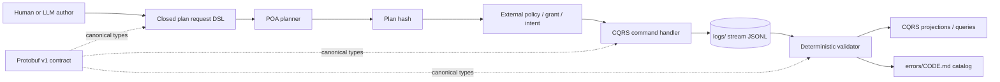

# Logs control-plane architecture

Status: accepted v0.1 design for `ticket-001`.

## Scope

`wellmanifest/logs` controls the repository representation of operational
events and reusable error knowledge. It validates facts; it is not a general
logging backend, a secret store or a generic command executor.

The canonical cross-language model is Protobuf. Git stores deterministic JSON
projections because JSONL supports review, replay and one-event-per-line
append semantics. Error guidance is Markdown for humans and agents, with one
closed JSON DSL object embedded in each `errors/{CODE}.md` file.

## Reference architecture

No arrow grants authority implicitly. A valid DSL, schema, Protobuf message,
plan or LLM answer is evidence only. Mutation requires an external authority
boundary bound to the exact plan and target.

## POA processes

The v0.1 namespace declares exact logical processes:

| URI Process | Kind | Responsibility |
| --- | --- | --- |
| `logs://repository/contracts/query/inspect` | query | Return contract identity and capabilities. |
| `logs://repository/events/query/validate` | query | Validate all streams and error documents without mutation. |
| `logs://stream/events/query/plan-append` | query | Produce a secret-free append plan for an immutable event draft. |
| `logs://stream/events/command/append` | command | Append only through a trusted, plan-bound controller. |
| `logs://repository/errors/command/register` | command | Register a reviewed error definition and runbook. |

The request grammar exposes only `inspect` and `plan_append`. It cannot
generate `append`, a path, URI binding, grant, intent, credential, shell command
or transport setting.

## CQRS boundary

Commands validate expected stream version, idempotency, authority and domain
invariants before emitting an event. They do not edit past events. Queries read
contracts, validate the store or build projections and must not mutate state.

The repository conformance runtime implements the read-only query side. The
Protobuf contract reserves the command boundary for trusted adapters; v0.1 does
not pretend that local validation is an authorization service.

## Event Sourcing projection

Each `logs/{stream}.jsonl` line is one canonical `wellmanifest.logs/event/v1`
object. A stream has:

- a stable stream name and monotonic sequence starting at 1;
- a unique event ID, correlation ID and optional causation ID;
- a bounded event type, severity, producer, subject and outcome;
- bounded evidence references with exact SHA-256 digests;
- `previousHash`, with 64 zeroes at genesis, and a recomputed `eventHash`;
- explicit `rawOutputIncluded=false` and `secretMaterialIncluded=false`.

There is no arbitrary payload or raw message field in v0.1. This deliberately
trades convenience for predictable review and a smaller exfiltration surface.

## Error knowledge

Every stable runtime code must have exactly one `errors/{CODE}.md`. The file
title, filename and embedded `wellmanifest.logs/error/v1` object must agree.
Required human sections explain situation, meaning, safe resolution,
verification, prohibited shortcuts and related event types.

The checker validates the catalog bidirectionally: emitted codes cannot lack a
page, and pages cannot invent codes not present in the contract bundle.

## Invariants

1. Protobuf field numbers and enum values are stable within v1.
2. All JSON object schemas are closed.
3. JSONL bytes are canonical and hash chained.
4. Repository-relative evidence cannot escape the root and must match bytes.
5. Raw output, secrets, unknown fields and unbounded payloads are rejected.
6. Error documentation never waives a finding.
7. LLM output is propose-only and never a command, grant or approval.

