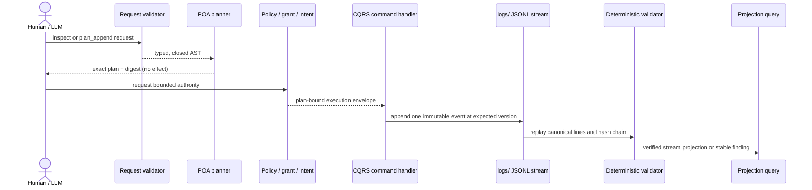

# Logs control-plane logic flow

## Consumer adoption check

A repository that vendors the canonical event schema must prove that its copy
still has the same semantic JSON as the current contract bundle:

```bash
python3 standard/logs_check.py adoption \
  --root /path/to/wellmanifest/logs \
  --event-schema /path/to/consumer/logs-event.schema.v1.json
```

The comparison ignores formatting and object-key order but rejects every
semantic difference, including a missing required field. A consumer that needs
a different shape must publish a separately versioned projection and a
declared mapping; it must not reuse `wellmanifest.logs/event/v1`.

## Event creation



The authored request stops at planning. A controller outside the LLM boundary
must bind subject, target, exact plan, grant, intent and expected stream version
before an append command can exist.

## Repository validation

```text
load contract bundle + Protobuf source
              |
              v
check closed schemas, request grammar and catalog
              |
              +--> validate errors/{CODE}.md identity and embedded DSL
              |
              +--> replay each logs/*.jsonl stream
                        |
                        +--> canonical bytes
                        +--> exact fields and safe flags
                        +--> sequence + previousHash + eventHash
                        +--> evidence confinement and digest
                        +--> event type: reserved core or namespaced deployment
                        +--> mode, source, subjectState, inputHash, receiptRef
                        +--> event code resolves to error catalog
              |
              v
stable LOGS-VALIDATION-001 findings or PASS
```

Validation is read-only and deterministic. One malformed line does not cause
the checker to trust later chain state. The report names a safe path and rule,
but does not echo rejected payload values.

## Protobuf and projections

Protobuf owns message names, field numbers, enums and service separation.
`contracts/logs.contract.json` bundles the closed JSON projection schemas,
request grammar, process URIs and diagnostic catalog. JSONL and embedded error
DSL are projections of those types, not competing semantic definitions.

Buf lint verifies Protobuf syntax and style. The Python conformance runtime
also checks that required messages, service methods, enum vocabulary and the
contract bundle remain mutually complete.

## Adopting the contract in a deployment

A deployment does not extend the reserved vocabulary; it uses its own namespace
next to it. The mapping that `maskservice/c2004` would need is the worked
example:

| c2004 field | Contract field | Note |
| --- | --- | --- |
| `oql` = `ticket.status_change` | `eventType` | Already namespaced, so it validates unchanged. |
| `source` = `planfile.history` | `source` | Direct. |
| `actor` = `cursor` | `producer` = `agent:cursor` | The actor kind becomes the producer prefix. |
| `uri` = `planfile://tickets/PLF-2070/command/status_change` | `subjectRef` | The POA Process URI is the subject. |
| `status` = `done` | `subjectState` | Lifecycle state, not `outcome`. |
| — | `outcome` | New fact: did this append succeed, not what the ticket became. |
| `mode` = `apply` | `mode` = `APPLY` | Uppercased; `PLAN` becomes expressible. |
| `input_hash` | `inputHash` | Direct. |
| `data.payload` | *(dropped)* | No arbitrary payload exists; `inputHash` binds it instead. |
| `receipt_ref` = `"-"` | `receiptRef` = `null` | The sentinel is rejected. |
| `causation_id` = `"-"` | `causationId` = `null` | The sentinel is rejected. |
| `replayable`, `kind` | *(dropped)* | Constant across 315 events, so they carried no information. |
| — | `sequence`, `previousHash` | The deployment had no chain; adoption must add one. |

The last row is the real cost of adoption. Everything else is a rename; the
hash chain has to be produced by the writer and cannot be reconstructed from a
stream that never had it.

## Failure handling

All deterministic failures use `LOGS-VALIDATION-001` plus a bounded rule and
help path `errors/LOGS-VALIDATION-001.md`. Examples include contract drift,
non-canonical JSON, broken chains, unsafe flags, missing evidence, malformed
error pages and an authority-bearing model request.

The safe recovery order is:

1. stop append activity for the affected stream;
2. classify whether bytes are uncommitted, committed or externally published;
3. correct the producer or add a compensating event rather than rewriting
   published history;
4. repair the error definition when the catalog is incomplete;
5. rerun host, Docker, Buf and governance checks.

Never disable hash checks, delete unknown history, redact by overwriting a
published event or treat an LLM explanation as proof that a chain is valid.
