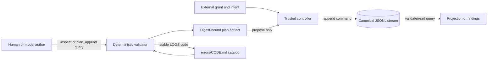

# LOGS-VALIDATION-001: Logs contract, chain or diagnostic documentation is invalid

## Error DSL

```log-error-dsl
{"category":"CONTRACT","causes":["A Protobuf or JSON projection no longer matches the v1 compatibility unit","A JSONL stream has non-canonical bytes, an invalid sequence, unsafe flags or a broken hash chain","An event references missing or changed evidence","The stable diagnostic catalog and errors directory differ","A model-authored request crosses the propose-only authority boundary"],"code":"LOGS-VALIDATION-001","doNot":["Do not disable schema, canonical-byte, evidence or hash-chain checks","Do not rewrite or delete published history before classifying its provenance","Do not put secrets, raw output or an arbitrary payload into a v1 event","Do not treat an LLM explanation or a Markdown page as approval"],"meaning":"The logs control plane cannot prove that its typed contracts, event history and reusable error guidance describe one safe, replayable state.","owner":"unresolved:human","relatedEventTypes":["validation_failed","error_raised"],"remediation":["Stop append activity for the affected stream","Read the finding rule and path without copying rejected values into another log","Restore the Protobuf, contract bundle, canonical event bytes, evidence digest or error page from an approved source","For published history add a reviewed compensating event instead of editing an earlier fact","Run all host, Docker, Buf and governance verification commands"],"schema":"wellmanifest.logs/error/v1","severity":"ERROR","title":"Logs contract, chain or diagnostic documentation is invalid","verification":["python3 standard/logs_check.py validate --root .","python3 standard/logs_check.py self-test","docker compose run --rm conformance","docker compose run --rm tests","docker compose run --rm -v /root/.cache proto","./project/governance-check.sh --actor agent"],"version":1}
```

## Situation

The deterministic validator rejected a contract, a log-stream fact, evidence,
an error definition or a propose-only request. The finding includes a bounded
rule and repository-relative path but intentionally does not echo untrusted
payload values.

## Meaning

The repository is not a provably replayable representation of the declared
Protobuf and JSON DSL compatibility unit. Until validation passes, downstream
queries, projections and append plans must treat the affected state as invalid.

## Safe resolution

1. Stop append activity for the affected stream.
2. Classify whether the invalid bytes are only local, committed, or externally
   published.
3. Repair the producer, contract, evidence digest or error page inside a
   bounded ticket.
4. Preserve published facts; use a reviewed compensating event when history
   has already left the repository boundary.
5. Run every command listed in the embedded `verification` array.

## Verification

The Python validator and self-test must pass on the host and in the pinned,
networkless container. Buf must lint the canonical Protobuf contract, and the
repository governance gate must report zero errors and warnings for the exact
candidate diff.

## Do not

Do not bypass checks, delete unknown history, mutate a published event, add a
generic payload field, copy secrets into evidence, or accept an LLM-generated
grant/intent as authority.

## Related events

Emit `validation_failed` when validation cannot establish conformance and
`error_raised` when this stable code becomes part of an operational stream.

## Architecture and logic flow

The control plane combines POA process identity, CQRS separation and an
event-sourced repository projection. A generated plan is evidence for a later
decision; it is never the decision itself.



- POA fixes each operation to one `logs://.../(query|command)/...` Process URI.
- CQRS prevents inspect, validation and planning queries from mutating streams;
  only the trusted append command can create a new fact.
- Event Sourcing makes each JSONL line immutable and orders it by stream,
  sequence, predecessor hash and canonical event hash.

## Protobuf projection map

| Canonical Protobuf type | Repository/runtime projection |
| --- | --- |
| `LogEvent`, `EvidenceRef` | One canonical line in `logs/{stream}.jsonl` |
| `ErrorDefinition` | One canonical `log-error-dsl` object in `errors/{CODE}.md` |
| `InspectRequest`, `PlanAppendRequest` | Closed JSON/GBNF model-authoring boundary |
| `ExecuteAppendRequest` | Trusted command boundary; never model-authorized |
| `Finding`, `ValidateRepositoryResponse` | Deterministic validation report |
| `ReadStreamResponse` | Read-only CQRS stream projection |
| `ExecuteAppendResponse` | Append receipt bound to plan and event hashes |

## Failure semantics

Validation is read-only and fail-closed. A malformed contract prevents dependent
checks; an invalid error catalog prevents event-code resolution; and a stream
failure stops that stream at the first unprovable fact. Findings expose a stable
rule and path without echoing rejected payload data. No failure path rewrites
history, grants authority or attempts automatic cleanup.

## Safe extension rules

1. Add fields or vocabulary only in a versioned Protobuf-first compatibility
   change, then update the closed JSON projection and deterministic checker.
2. Preserve existing field numbers, canonical hash rules and published JSONL
   bytes; use compensating events for already-published facts.
3. Keep model-facing grammars query-only and closed. New commands require an
   external trusted controller and cannot be inferred from a plan or Markdown.
4. Register each new emitted code in the contract and add exactly one matching
   `errors/{CODE}.md` before an event may reference it.
5. Extend adversarial tests for every new field, event type, process and failure
   mode before changing the contract version.
